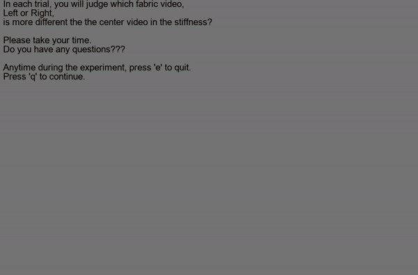

[](https://github.com/BumbleBee0819/Estimating_mechanical_properties_of_cloth/issues/)
[](https://opensource.org/licenses/MIT)
[]()
[]()
[]()
[]()


<h1 align="center"> Estimating mechanical properties of cloth from videos using dense motion trajectories: Human psychophysics and machine learning </h1>

<p align="center">
    
    
    
    


## Description    
In this project, we use Blender (2.7.6) rendered cloth animations as our dataset.
* First, we used a maximum likelihood differential scaling (MLDS) method to measure the human perceptual scale of cloth stiffness. Codes and instructions of this experiment can be found in the [MLDS_Experiment](https://github.com/BumbleBee0819/Estimating_mechanical_properties_of_cloth/tree/master/MLDS_Experiment) folder. 


<div class="image12">
    <p align="center"></p>
</div>
<p align="center">Maximum likelihood differential scaling (MLDS)</strong></p>


* Next, we extracted the dense motion trajectory features of all the cloth videos.

<p align="center">
    
<p align="center">Dense motion trajectory features</strong></p>

* Using the extracted dense motion trajectory features, we built a support vector regression (SVR) model to predict the human perceptual scale of stiffness. Codes and instruction of this experiment can be found in the [MotionAnalysis](https://github.com/BumbleBee0819/Estimating_mechanical_properties_of_cloth/tree/master/MotionAnalysis) folder.

<p align="center">
    
<p align="center">Computational modeling of human perceptual scale</strong></p>


## Dependencies
* [Psychtoolbox](http://psychtoolbox.org/credits/) in Matlab.
* [VLFeat Matlab toolbox](http://www.vlfeat.org/download.html) (vlfeat-0.9.20). 
* [Yael for Matlab](http://yael.gforge.inria.fr/matlab_interface.html) (yael_v438).
* [Dense trajectories video descriptors](https://lear.inrialpes.fr/people/wang/dense_trajectories) (third version).
* [ffmpeg-0.11.1](https://ffmpeg.org/releases/).


## References
If you use the codes, please cite the following papers.
```
1. Bi, W., Jin, P., Nienborg, H., & Xiao, B. (2018). Estimating mechanical properties of cloth from videos using dense motion trajectories: Human psychophysics and machine learning. Journal of Vision, 18(5):12, 1–20.
2. Brainard, D. H., & Vision, S. (1997). The psychophysics toolbox. Spatial vision, 10, 433-436.
3. Knoblauch, K., & Maloney, L. T. (2008). MLDS: Maximum likelihood difference scaling in R. Journal of Statistical Software, 25(2), 1–26.
4. Maloney, L. T., & Yang, J. N. (2003). Maximum likelihood difference scaling. Journal of Vision, 3(8): 5, 573–585.
5. Wang, H., Kläser, A., Schmid, C., & Cheng-Lin, L. (2011, June). Action recognition by dense trajectories.
6. Wang, H., & Schmid, C. (2013). Action recognition with improved trajectories. In Proceedings of the IEEE international conference on computer vision (pp. 3551-3558).
```


## Contact
If you have any questions, please contact "wb1918a@american.edu".
